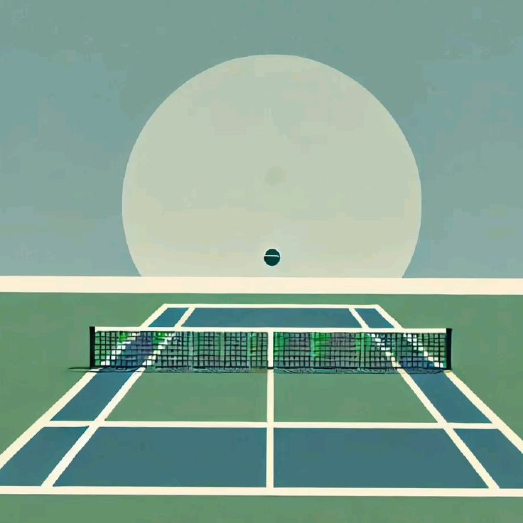

# Tennis Scoreboard Project 🎾🥎




---
# Important Things

## Objective of the Project 📈
- Get to know the MVC pattern
- Use of HTTP response codes
- Learn to work with Java servlets
- Learn to Hibernate
- Get acquainted with SQL language and learn basic DDL, DML commands

## Tools Used in the Project 🛠️
- 🚀 **Servlet API:** A standardized API designed for implementation on the server and working with the client using a request-response scheme.
- 💾 **H2 Database:** A lightweight, in-memory database used for data storage during runtime in this project.
- 🐱‍👤 **Hibernate:** An object-relational mapping (ORM) framework for Java, facilitating the interaction between Java applications and relational databases.
- ⚙️ **Apache Tomcat:** A Java web application server.
- 📦 **Maven:** A software project management and comprehension tool.

---

# Quick Start Guide for Tennis Scoreboard ⚡

## Installation Instructions

1. Clone the repository:

   ```bash
   [https://github.com/fearrux/tennis-scoreboard.git](https://github.com/fearrux/tennis-scoreboard.git)
   ```  
2. Open IntelliJ IDEA.
3. In the main menu, click on Open and select the folder you cloned in the first step.
4. In IntelliJ IDEA, go to the Run menu, then select Edit -> Configurations
5. In the window that appears, click the + button and add Tomcat Server -> Local.
6. Next to the warning Warning: No artifacts marked for deployment, click the Fix button.
7. In the new window, select tennis-scoreboard.war exploded.
7. Leave the Application context field as just /.
8. Click Apply and start Tomcat.

# Share Your Thoughts 💬✨
I am always eager to enhance my programming skills and improve my project implementations. Your insights, suggestions, and constructive criticism are invaluable to me! If you have any feedback or would like to discuss any aspect of this project, I would love to hear from you.
Feel free to open an issue and share your thoughts or ideas! Your contributions can help shape the future of this project. Thank you for your support! 🙌
👉 [Share Your Feedback Here](https://github.com/tem1dev/currency-exchange/issues).  

# 🌟 Overview
We would like to extend our heartfelt thanks to **Sergey Zhukov** for his invaluable contributions and support throughout this project. You can check out his work on GitHub: [Sergey Zhukov's GitHub](https://github.com/zhukovsd).
Additionally, for those interested in furthering their Java knowledge, we recommend the Java Roadmap course available here: [Java Backend Learning Course](https://zhukovsd.github.io/java-backend-learning-course/).
